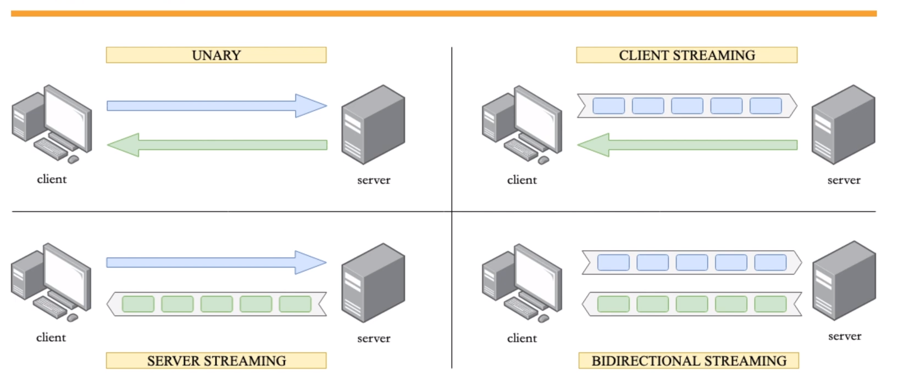

# What is grpc

是一个高性能、通用的开源RPC框架

## 使用协议缓冲区

让服务器和客户端生成存根，首先需要编写API合同（服务描述+有效载荷信息）

## 使用http2作为传输协议

gRPC使用http2作为传输协议

1. 基于HTTPS更加安全
2. 头部压缩,消除重复的头部
3. HTTP/2 不再像 HTTP/1.1 ⾥的纯⽂本形式的报⽂，⽽是全⾯采⽤了⼆进制格式，头信息和数据体都是⼆进制，并且统称为帧（frame）：头信息帧和数据帧。增加了传输效率
4. HTTP/2 是可以在⼀个连接中并发多个请求或回应，⽽不⽤按照顺序⼀⼀对应，移除了 HTTP/1.1 中的串⾏请求，不需要排队等待，也就不会再出现「队头阻塞」问题，降低了延迟，⼤幅度提⾼了连接的利⽤率。
5. 服务器推送

## gRPC 的四种通信方式

1. 类似REST的单请求+单回复
2. 客户端多请求+服务端单回复
3. 客户端单请求+服务端多回复
4. 客户端多请求+服务端多回复

### gRPC VS REST

1. gRPC Use http2 as transport protocol but REST use http1.1,so gRPC is faster
2. gRPC 使用二进制传输，而REST使用文本传输，所以gRPC更加小
3. gRPC 的API合同十分严格，需要在原文中定义，而REST则十分宽松。
4. gRPC 的代码生成内置，而REST则需要第三方工具
5. gRPC 使用流式传输，而REST使用块式传输，所以gRPC更加灵活
6. REST 支持浏览器访问，而gRPC不支持。

### gRPC 适合哪些场景
1. 微服务
   1. 低延迟和高吞吐
   2. 强大的协议
   3. 多语言场景
   4. 点对点实时通信
   5. 低网络场景

